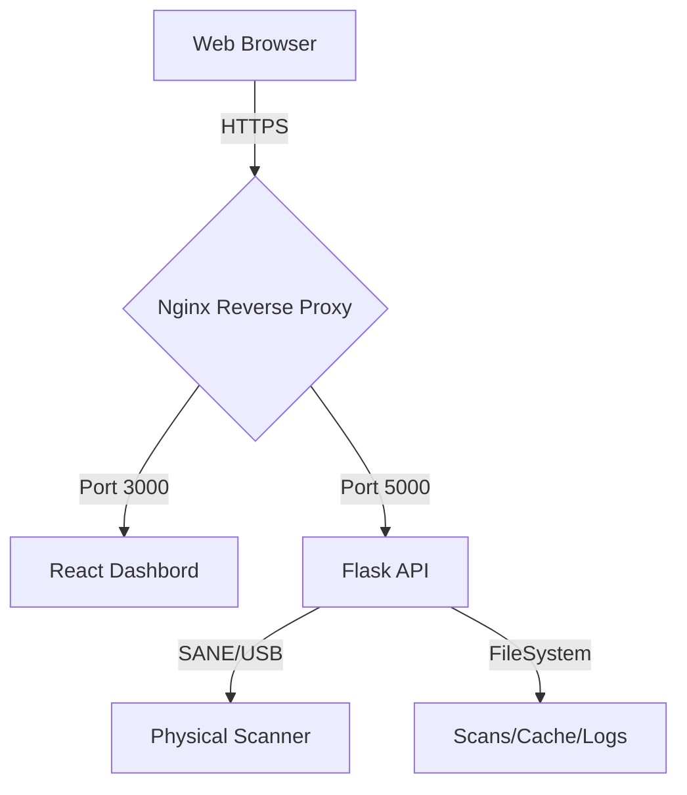

# Scanner Bridge: Enterprise Deployment Guide

Professional orchestration for the modern scanner interface. This guide covers deploying Scanner Bridge to production environments with a focus on reliability, security, and performance.

## 🏗 Architecture Overview



---

## 📋 Prerequisites

Before proceeding, ensure your environment meets the following requirements:

- **Hardware**: Linux-compatible scanner connected via USB.
- **Drivers**: `sane-utils` and relevant backend drivers installed on the host.
- **Software**: Docker 20.10+ and Docker Compose 1.29+ (Recommended).
- **Network**: Ports 80 and 443 open for web access.

---

## 🐳 Docker Deployment (Recommended)

The most reliable way to ship Scanner Bridge. Our Docker setup handles dependencies and device mapping automatically.

### 1. Environment Setup
Clone the repository and prepare your environment variables:
```bash
cp .env.example .env
# Edit .env with your production domain and settings
```

### 2. Launch Services
Run the following command to build and start the entire stack:
```bash
docker-compose up -d
```

> [!IMPORTANT]
> Ensure the user running Docker has permissions to access USB devices. On most Linux distributions, this requires being in the `lp` or `scanner` group.

### 3. Verify Health
```bash
curl http://localhost:5000/health
docker-compose logs -f
```

---

## 🛠 Native Deployment

For environments where containerization is not available.

### Backend (Python/Flask)
1. **Prepare Virtual Environment**:
   ```bash
   cd backend
   python3 -m venv venv
   source venv/bin/activate
   pip install -r requirements.txt
   ```
2. **Production Execution**:
   ```bash
   gunicorn -w 4 -b 0.0.0.0:5000 --access-logfile ../logs/access.log app:app
   ```

### Frontend (React/Vite)
1. **Build Assets**:
   ```bash
   cd frontend
   npm install
   npm run build
   ```
2. **Serve Statics**:
   Use `nginx` or `serve` to deliver the `dist` directory.

---

## ⚙️ Configuration Masterclass

### Environment Variables (`.env`)
| Variable | Description | Default |
| :--- | :--- | :--- |
| `FLASK_ENV` | Environment mode | `production` |
| `SCANNER_TIMEOUT` | Max scan duration (sec) | `30` |
| `CORS_ORIGINS` | Trusted web domains | `*` |

### Scanner Configuration (`config/scanner.config.json`)
Fine-tune image processing and storage limits:
```json
{
  "scanner": {
    "default_format": "jpeg",
    "compression_quality": 85
  },
  "storage": {
    "max_cache_size": 104857600
  }
}
```

---

## 🛡 Security & Hardening

1. **SSL/TLS**: Always use HTTPS. Our [nginx.conf](nginx.conf) is pre-configured for Let's Encrypt.
2. **Firewall**: Restrict access to ports other than 80/443.
   ```bash
   sudo ufw allow 80,443/tcp
   sudo ufw deny 5000/tcp
   ```
3. **Permissions**: Use a dedicated service user.
   ```bash
   sudo useradd -m scanner-service
   sudo chown -R scanner-service:scanner-service /opt/scanner-bridge
   ```

---

## 📈 Operational Excellence

### Monitoring
- **Health Check**: `GET /health` returns JSON status.
- **Log Rotation**: Logs are stored in `./logs`. Docker handles rotation via the `json-file` driver.

### Backup Strategy
```bash
# Snapshot scanned documents
tar -czf backups/scans-$(date +%F).tar.gz ./scans/
```

### Scaling
- **Horizontal**: Use Docker Compose `scale` for backend workers.
- **Vertical**: Increase `gunicorn` worker count based on CPU cores.

---

## 🔍 Troubleshooting

> [!TIP]
> **Scanner Not Detected?**
> Run `scanimage -L` on the host. If the scanner isn't found there, Docker won't see it either.

> [!WARNING]
> **Permission Denied?**
> Check if `udev` rules are allowing access to `/dev/bus/usb`. You may need to create a rule in `/etc/udev/rules.d/`.

---

For further assistance, please refer to the [QUICKSTART.md](QUICKSTART.md) or open an issue in the repository.
